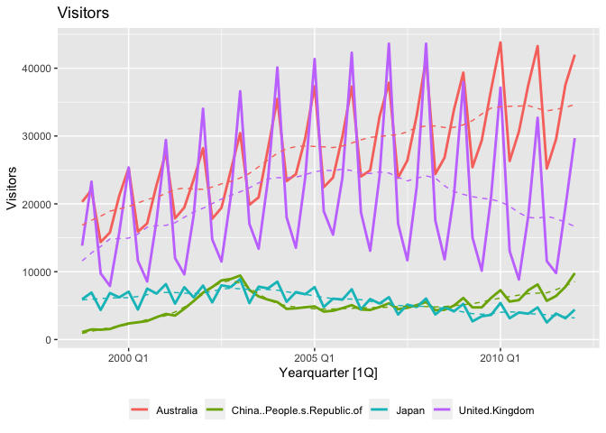
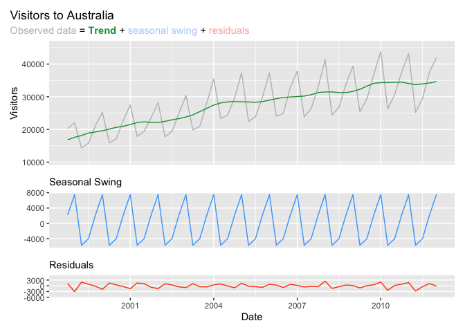
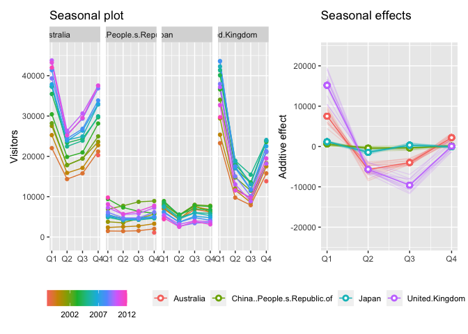
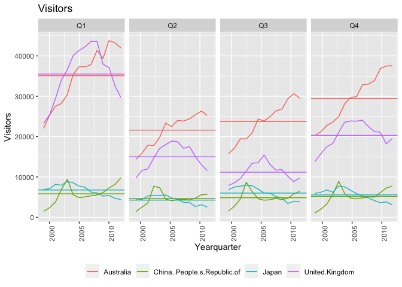

# iNZightTS2: Time Series Visualisation and Forecasting

[](https://github.com/iNZightVIT/iNZightTS2/actions?workflow=R-CMD-check)
[](https://codecov.io/gh/iNZightVIT/iNZightTS2?branch=dev)
[](http://www.gnu.org/licenses/gpl-3.0)

<!-- [](https://CRAN.R-project.org/package=iNZightTS2) -->

## Overview

The iNZightTS2 package provides some simple analysis tools for exploring
time series data, which is used by
[iNZight](https://github.com/iNZightVIT/iNZight). The package uses
[tidyverts](https://tidyverts.org/) to store and process time series
data and [ggplot2](https://github.com/tidyverse/ggplot2) to produce
customisable graphics.

## Installation

<!-- The _stable_ version can be installed from [CRAN](https://cran.r-project.org/web/packages/iNZightTS2/index.html):


````r
install.packages("iNZightTS2")
``` -->

Install from [GitHub](https://github.com/iNZightVIT/iNZightTS2):

\`\`\`\`

``` r
remotes::install_github("iNZightVIT/iNZightTS2")
```

## Usage

``` r
library(iNZightTS2)
library(dplyr)
library(tidyr)
```

### Getting started

Use the `inzightts` function to create a temporal data set to be used by
the functions of the package. The data is stored as a
[tsibble](https://github.com/tidyverts/tsibble).

``` r
data <- visitorsQ %>%
    pivot_longer(!Date, names_to = "Country", values_to = "Visitors") %>%
    inzightts(key = "Country")
data
#> # A tsibble: 216 x 3 [1Q]
#> # Key:       Country [4]
#>      index Country   Visitors
#>      <qtr> <chr>        <int>
#>  1 1998 Q4 Australia    20288
#>  2 1999 Q1 Australia    22047
#>  3 1999 Q2 Australia    14362
#>  4 1999 Q3 Australia    15775
#>  5 1999 Q4 Australia    21209
#>  6 2000 Q1 Australia    25261
#>  7 2000 Q2 Australia    15891
#>  8 2000 Q3 Australia    17117
#>  9 2000 Q4 Australia    22761
#> 10 2001 Q1 Australia    27539
#> # … with 206 more rows
```

### Graphics

Exploratory analysis of time series data starts from a smoothed line
plot.

``` r
plot(data)
```



### Decompositions

Time series data often exhibit features such as trend, season and cycle.
A decomposition plot breaks the data into visual components which
simplies the analysis.

``` r
dcmp <- data %>%
    filter(Country == "Australia") %>%
    inzightts() %>%
    decomp()
dcmp
#> # A dable: 54 x 8 [1Q]
#> # Key:     Country, .model [1]
#> # :        Visitors = trend + season_year + remainder
#>    Country   .model                                     index Visit…¹  trend seaso…² remai…³ seaso…⁴
#>  * <chr>     <chr>                                      <qtr>   <dbl>  <dbl>   <dbl>   <dbl>   <dbl>
#>  1 Australia feasts::STL(Visitors ~ trend() + season… 1998 Q4   20288 16858.   2191.   1239.  18097.
#>  2 Australia feasts::STL(Visitors ~ trend() + season… 1999 Q1   22047 17586.   7515.  -3054.  14532.
#>  3 Australia feasts::STL(Visitors ~ trend() + season… 1999 Q2   14362 18173.  -5731.   1920.  20093.
#>  4 Australia feasts::STL(Visitors ~ trend() + season… 1999 Q3   15775 18928.  -3975.    822.  19750.
#>  5 Australia feasts::STL(Visitors ~ trend() + season… 1999 Q4   21209 19248.   2191.   -230.  19018.
#>  6 Australia feasts::STL(Visitors ~ trend() + season… 2000 Q1   25261 19601.   7515.  -1855.  17746.
#>  7 Australia feasts::STL(Visitors ~ trend() + season… 2000 Q2   15891 20127.  -5731.   1496.  21622.
#>  8 Australia feasts::STL(Visitors ~ trend() + season… 2000 Q3   17117 20652.  -3975.    439.  21092.
#>  9 Australia feasts::STL(Visitors ~ trend() + season… 2000 Q4   22761 20972.   2191.   -402.  20570.
#> 10 Australia feasts::STL(Visitors ~ trend() + season… 2001 Q1   27539 21528.   7515.  -1504.  20024.
#> # … with 44 more rows, and abbreviated variable names ¹​Visitors, ²​season_year, ³​remainder,
#> #   ⁴​season_adjust
```

``` r
plot(dcmp, title = "Visitors to Australia")
```



### Visualising seasonal effects

Plots are helpful in revealing the underlying seasonal pattern of time
series data.

``` r
seasonplot(data)
```



``` r
subseries(data)
```



### Forecasting

``` r
pred <- predict(data)
summary(pred)
#> 
#> 95% Prediction Interval
#> # A tsibble: 32 x 5 [1Q]
#> # Key:       Country [4]
#>    Country                        Time Fitted  Lower  Upper
#>    <chr>                         <qtr>  <dbl>  <dbl>  <dbl>
#>  1 Australia                   2012 Q2 25550. 23052. 28047.
#>  2 Australia                   2012 Q3 30625. 27790. 33461.
#>  3 Australia                   2012 Q4 38674. 35748. 41600.
#>  4 Australia                   2013 Q1 43773. 40821. 46724.
#>  5 Australia                   2013 Q2 26915. 23421. 30409.
#>  6 Australia                   2013 Q3 31797. 28162. 35433.
#>  7 Australia                   2013 Q4 39874. 36199. 43549.
#>  8 Australia                   2014 Q1 44769. 41082. 48456.
#>  9 China..People.s.Republic.of 2012 Q2  8069.  6999.  9138.
#> 10 China..People.s.Republic.of 2012 Q3  8624.  6704. 10544.
#> 11 China..People.s.Republic.of 2012 Q4  9797.  7199. 12395.
#> 12 China..People.s.Republic.of 2013 Q1 11054.  7964. 14145.
#> 13 China..People.s.Republic.of 2013 Q2  8710.  4944. 12477.
#> 14 China..People.s.Republic.of 2013 Q3  8957.  4581. 13333.
#> 15 China..People.s.Republic.of 2013 Q4  9874.  5038. 14710.
#> 16 China..People.s.Republic.of 2014 Q1 11139.  5991. 16287.
#> 17 Japan                       2012 Q2  2106.  1267.  2945.
#> 18 Japan                       2012 Q3  3239.  2052.  4425.
#> 19 Japan                       2012 Q4  2789.  1336.  4242.
#> 20 Japan                       2013 Q1  4017.  2340.  5695.
#> 21 Japan                       2013 Q2  1719.  -397.  3835.
#> 22 Japan                       2013 Q3  2851.   374.  5329.
#> 23 Japan                       2013 Q4  2401.  -391.  5194.
#> 24 Japan                       2014 Q1  3630.   554.  6706.
#> 25 United.Kingdom              2012 Q2  9296.  6244. 12349.
#> 26 United.Kingdom              2012 Q3  8283.  4829. 11737.
#> 27 United.Kingdom              2012 Q4 17986. 14450. 21522.
#> 28 United.Kingdom              2013 Q1 28182. 24566. 31798.
#> 29 United.Kingdom              2013 Q2  7784.  2531. 13037.
#> 30 United.Kingdom              2013 Q3  6771.  1006. 12535.
#> 31 United.Kingdom              2013 Q4 16474. 10514. 22434.
#> 32 United.Kingdom              2014 Q1 26670. 20520. 32820.
#> 
#> Model:
#> # A mable: 4 x 2
#> # Key:     Country [4]
#>   Country                                              Visitors
#>   <chr>                                                 <model>
#> 1 Australia                   <ARIMA(1,0,0)(1,1,0)[4] w/ drift>
#> 2 China..People.s.Republic.of          <ARIMA(2,0,0)(1,1,0)[4]>
#> 3 Japan                                <ARIMA(0,1,0)(0,1,1)[4]>
#> 4 United.Kingdom                       <ARIMA(0,1,2)(0,1,0)[4]>
```

``` r
plot(pred)
```


